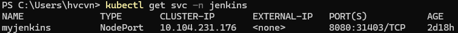
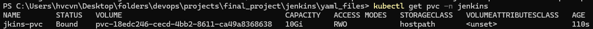
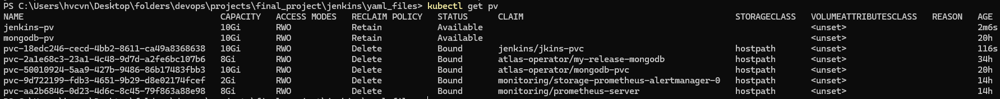
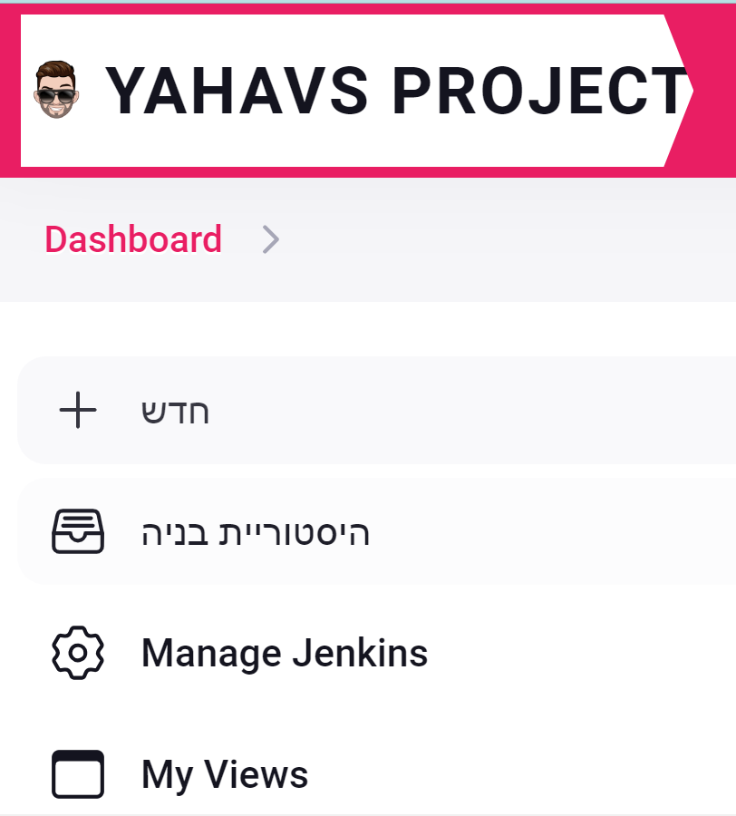

# Jenkins server establishment on docker-desktop
Running a Jenkins server on your Docker Desktop Kubernetes cluster using Helm is a straightforward process. 

Here's a step-by-step guide (the commands are on powershell):

## Step 1: Install Helm
First, you need to have Helm installed on your system. If you haven't installed it yet, you can follow these instructions:

For Windows, you can download Helm using Chocolatey: 
```
choco install kubernetes-helm
```

Verify Helm Installation:

```
helm version
```

## Step 2: Create a Namespace for Jenkins
It's a good practice to create a separate namespace for Jenkins:
```
kubectl create namespace jenkins
```

## Step 3: Add Jenkins Helm Repository
Add the Jenkins Helm chart repository to your Helm configuration:

```
helm repo add jenkins https://charts.jenkins.io
helm repo update
```

## Step 4: Install Jenkins Using Helm
Now you can install Jenkins using the Helm chart. Here’s how you can do it with default settings:
```
 helm upgrade --install myjenkins jenkins/jenkins --namespace jenkins
```
## Step 5: Monitor the Deployment
Check the status of the Jenkins pods to ensure they are running:
```
kubectl get pods --namespace jenkins
```
You should see the Jenkins pod listed with a status of Running after few minutes.

## step 6: Retrieve the Admin Password:
The Jenkins admin password is stored in a Kubernetes secret. Retrieve it using: (the username is - "admin")
``` 
$password = kubectl exec --namespace jenkins -it svc/myjenkins -c jenkins -- /bin/cat /run/secrets/additional/chart-admin-password

Write-Output $password
```

## Change the myjenkins service type to NodePort:
```
kubectl patch svc myjenkins -n jenkins -p '{"spec": {"type": "NodePort"}}'
```



## step 8: Access Jenkins:
Open the a web browser.

Enter localhost:31403 in your browser's address bar.

<!-- ---------------------------------------------------------------

# Volumes:
Persistent Volumes provide a way to store data outside of the pod lifecycle. When a pod is deleted, its data is lost if stored inside the pod. Using PV and PVC, we can store Jenkins data (such as job configurations, build artifacts, etc.) persistently on the host machine or a cloud storage solution, ensuring data durability and resilience.

## Steps to Configure Persistent Volumes

### 1. Create a Persistent Volume (PV)

A Persistent Volume (PV) represents a piece of storage in the cluster that has been provisioned by an administrator. Here, we use the `hostPath` type, suitable for single-node clusters like Docker Desktop.

Create a file named `jenkins-pv.yaml`:

```yaml
apiVersion: v1
kind: PersistentVolume
metadata:
  name: jenkins-pv
spec:
  capacity:
    storage: 10Gi
  accessModes:
    - ReadWriteOnce
  hostPath:
    path: /mnt/data/jenkins
```
Apply the PV configuration: (make sure that you are in the relevant folder where the yaml file is stored)
```
kubectl apply -f jenkins-pv.yaml
```

### 2. Create a Persistent Volume Claim (PVC)
A Persistent Volume Claim (PVC) is a request for storage by a user. It binds to the PV we defined.

Create a file named `jenkins-pvc.yaml`: (note that the pvc needs to be in the same namespace as the service it mounted to)
```yaml
apiVersion: v1
kind: PersistentVolumeClaim
metadata:
  name: jkins-pvc
  namespace: jenkins
spec:
  accessModes:
    - ReadWriteOnce
  resources:
    requests:
      storage: 10Gi
```
Apply the PVC configuration:(make sure that you are in the relevant folder where the yaml file is stored)
```
kubectl apply -f jenkins-pvc.yaml
```
### 3. Update Jenkins Helm Chart to Use PVC
Ensure your Helm values configuration file (let's call it values.yaml) includes the PVC settings:
The file is used to customize the deployment of a Helm chart. In this case, the file is used to customize the Jenkins Helm chart to use a Persistent Volume Claim (PVC) for persistent storage

```yaml
persistence:
  enabled: true
  existingClaim: jenkins-pvc
  size: 10Gi
  storageClass: ""
  accessMode: ReadWriteOnce
```
Upgrade the Jenkins Helm release to apply these values:
```
helm upgrade myjenkins jenkins/jenkins --namespace jenkins -f values.yaml
```
### 4. Verify the Configuration
Check PVC Status:
```
kubectl get pvc -n jenkins
```



Ensure the PVC is bound to the PV.

Check PV Status:
```
kubectl get pv
```



Ensure the PV status is Bound.

Check Jenkins Pod Volume Mounts:
```
kubectl get pods -n jenkins
kubectl describe pod <jenkins-pod-name> -n jenkins
```
Look for the Volumes and Mounts sections to ensure the PVC is correctly mounted at /var/jenkins_home.

Verify Data Persistence:

- Create a job in Jenkins.

- Delete the Jenkins pod:
```
kubectl delete pod <jenkins-pod-name> -n jenkins
```
Ensure the job still exists after the pod restarts.


### By following these steps, you ensure that Jenkins data is stored persistently, providing resilience and durability to your Jenkins setup on Kubernetes.

------------------------ -->

## step 9: install Relevant plugins: (optional)
    should already be in the installed plugins: 
    - kubernetes
    - git
    - configuration-as-code

    Required to install
    - gitlab
    - blueocean
    - workflow-multibranch
    - login-theme
    - prometheus metrics
    - GitHub Authentication


## step 10: Theme Customization (optional)
   - Installed a theme plugin to customize the Jenkins logo and theme for a better visual experience.



## step 11: Clean up: (optional)
Once you've completed setup and ensured everything is working properly, clean up by deleting the Helm release (optional): 
```
helm uninstall myjenkins --namespace jenkins
kubectl delete namespace jenkins
```
