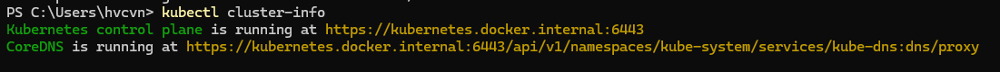
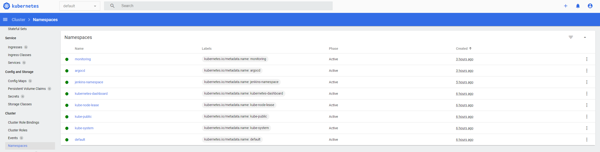

# Setting Up Kubernetes Dashboard

To set up the Kubernetes Dashboard, follow these steps:

1. **Install Docker Desktop and Enable Kubernetes:**
   - Start Docker Desktop and enable the Kubernetes extension.
   - withe the command: ```kubectl cluster-info``` you can get the cluster URL.

   

2. **Deploy Kubernetes Dashboard:**
   - Apply the recommended YAML file to deploy the Kubernetes Dashboard:
     ```bash
     kubectl apply -f https://raw.githubusercontent.com/kubernetes/dashboard/v2.6.0/aio/deploy/recommended.yaml
     ```

3. **Create Service Account:**
   - Create a service account named `dashboard-admin-sa` in the `kubernetes-dashboard` namespace:
     ```bash
     kubectl create service account dashboard-admin-sa -n kubernetes-dashboard
     ```

4. **Assign Cluster Role:**
   - Assign cluster-admin role to the service account `dashboard-admin-sa`:
     ```bash
     kubectl create clusterrolebinding dashboard-admin-sa --clusterrole=cluster-admin --serviceaccount=kubernetes-dashboard
     ```

5. **Start Proxy Server:**
   - Start a proxy server to access the Kubernetes API:
     ```bash
     kubectl proxy
     ```


6. **Access the Dashboard:**
   - Access the Kubernetes Dashboard at `http://127.0.0.1:8001` through your web browser.

7. **Login to the Dashboard:**
   - Obtain the access token for `dashboard-admin-sa` service account:
     ```bash
     kubectl get secret $(kubectl get serviceaccount dashboard-admin-sa -n kubernetes-dashboard -o jsonpath="{.secrets[0].name}") -n kubernetes-dashboard -o jsonpath="{.data.token}" | base64 --decode
     ```
   - Copy the token and use it to log in to the Kubernetes Dashboard.


   

### Conclusion

You have successfully set up the Kubernetes Dashboard on your local machine. By following these steps, you now have a graphical interface to manage and monitor your Kubernetes clusters effectively. Enjoy exploring and utilizing the dashboard to streamline your Kubernetes operations!
