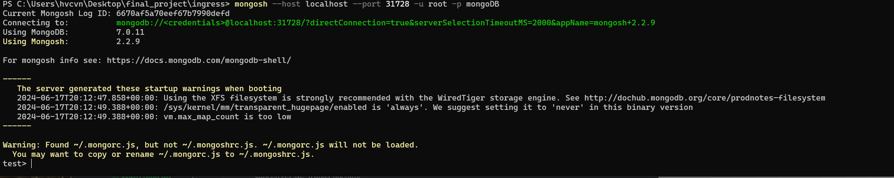

# MongoDB
This README file provides instructions on how to install MongoDB using Helm and expose it using a NodePort.

## Prerequisites

- A running Kubernetes cluster
- Helm installed on your local machine
- kubectl installed on your local machine
- mongosh cli

## Steps

### 1. Create a Namespace for MongoDB
Create a namespace for MongoDB to keep your Kubernetes resources organized.

kubectl create namespace atlas-operator


### 2. Create a values.yaml File
Create a ```values.yaml``` file to customize the MongoDB installation. This file will configure MongoDB to use a NodePort for external access.
```
architecture: standalone
auth:
  rootPassword: mongoDB
service:
  type: NodePort
  nodePort: 32017
```

### 3. Install MongoDB Using Helm
Use Helm to install MongoDB with the custom values specified in values.yaml.
```
helm install my-release oci://registry-1.docker.io/bitnamicharts/mongodb --namespace atlas-operator -f values.yaml
```

### Step 4: Verify the Installation
Check if the MongoDB pod is running:
```
kubectl get pods -n atlas-operator
```
You should see a pod with a name like my-release-mongodb... in the Running state.


### Step 5: Accessing MongoDB
Use a MongoDB client such as mongosh to connect to MongoDB using the NodePort.

kubectl get svc -n atlas-operator


mongosh --host localhost --port 31728 -u root -p mongoDB




## Cleanup
To uninstall MongoDB and remove the associated resources, run:
```
helm uninstall my-mongodb --namespace atlas-operator
kubectl delete namespace atlas-operator
```