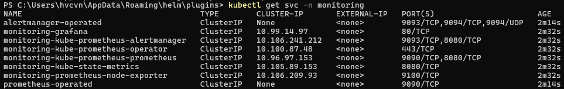
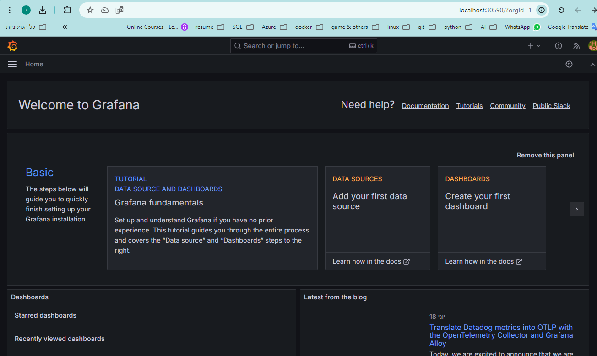

# Prometheus and Grafana solutions establishment
## Prometheus:
To install Prometheus in a custom namespace using Helm, you need to create the namespace first and then specify it during the Helm installation. Below are the adjusted commands to achieve this.

### Add the Prometheus & Grafana Helm Repository

First you need to create namespace:
```
kubectl create namespace monitoring
```
Then add the Prometheus Helm repository, following commands:
```
helm repo add prometheus-community https://prometheus-community.github.io/helm-charts -n monitoring
helm repo add stable https://charts.helm.sh/stable -n monitoring
helm repo update
```

After you added the repository, we need to install Prometheus in a custom namespace using the following command:
```
helm install monitoring prometheus-community/kube-prometheus-stack -n monitoring
```
It will install all the required components of the Prometheus system with a single command. Without Helm Charts we would have to write the manifest file ourselves.

---------- 
### Access Prometheus 
To access Prometheus web interface, you can set up port forwarding or expose it externally using a NodePort or LoadBalancer service.

First, check the Prometheus service to understand how it's configured. Run the following command and look for the Prometheus service in the output:
```
kubectl get svc -n monitoring 
```



Now we can expose the "monitoring-kube-prometheus-prometheus" service to the internet using nodeport by using the following command: 
```
kubectl edit svc monitoring-kube-prometheus-prometheus -n monitoring
```
In the editor, find the line that says type: ClusterIP and change it to type: NodePort. Save and exit the editor. Kubernetes will automatically apply these changes and assign a NodePort (typically in the range 30000-32767) to the service.

check the Prometheus service again : 
```
kubectl get svc -n monitoring 
```


Once the nodeport is set up, open your web browser (Chrome) and navigate to: (note to write right port number according to the last command (get svc))
```
http://localhost:31385
```


## Grafana:
### Access Grafana
By default, Grafana is exposed as a ClusterIP service within the monitoring namespace. 

To access Grafana’s web interface, you can set up port forwarding or expose it externally using a NodePort or LoadBalancer service (as we done in the Prometheus)
```
kubectl edit svc monitoring-grafana -n monitoring
```
In the editor, find the line that says type: ClusterIP and change it to type: NodePort. Save and exit the editor. Kubernetes will automatically apply these changes and assign a NodePort (typically in the range 30000-32767) to the service.

```
kubectl get svc -n monitoring grafana-ext
```


Once the nodeport is set up, open your web browser (Chrome) and navigate to: (note to write right port number according to the last command (get svc))
```
http://localhost:30393
```

### Log in to Grafana
Username: admin

Password: prom-operator 



### you can also check out this link to investigate things in depth:

https://medium.com/globant/setup-prometheus-and-grafana-monitoring-on-kubernetes-cluster-using-helm-3484efd85891