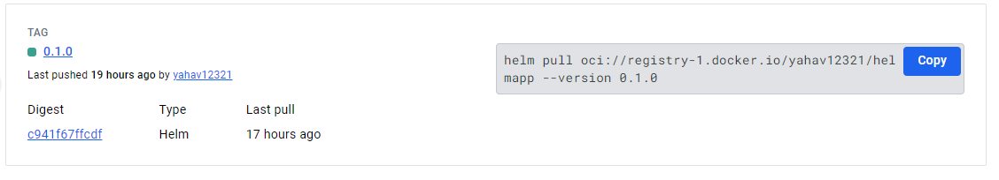
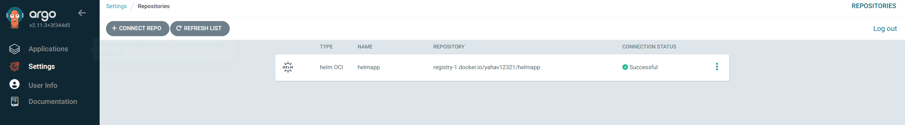
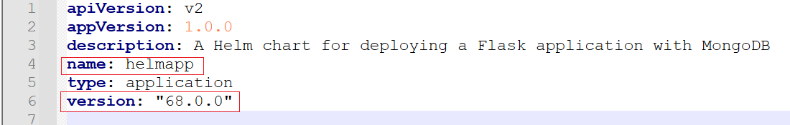
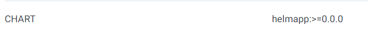
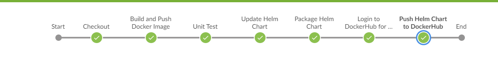

# K8s Application Deployment Pipeline
## Overview
This readme file outlines an end-to-end CI/CD pipeline that automates the deployment of a Flask application connected to MongoDB, running in a Kubernetes environment. The pipeline integrates Jenkins for continuous integration, Docker for containerization, Helm for package management and Argo CD for continuous deployment. 

Technologies Used: 
- Kubernetes: Container orchestration platform.
- Docker: Containerization technology.
- Flask: Python web framework.
- MongoDB: NoSQL database.
- Jenkins: Automation server for continuous integration.
- Helm: Package manager for Kubernetes.
- Argo CD: Declarative GitOps continuous delivery tool.

Before starting this readme , make sure you have a A functional application and you have read the previous readme of how to check your app locally!!

The structure and essential files: (before adding pytest)
```
my-app/
├── app/
│   ├── static/
│   ├── templates/
│   ├── app.py
│   ├── requirements.txt
│   ├── .gitattributes
│   └── .gitignore
├── helm-charts/
│   ├── argocd-app/
│   │   ├── templates/
│   │   │   └── application.yaml
│   │   ├── Chart.yaml
│   │   └── values.yaml
│   ├── todo-app/
│   │   ├── templates/
│   │   │   ├── service.yaml
│   │   │   ├── deployment.yaml
│   │   │   └── _helpers.tpl
│   │   ├── Chart.yaml
│   │   └── values.yaml
│   ├── helmapp/
│   │   ├── templates/
│   │   │   ├── service.yaml
│   │   │   ├── deployment.yaml
│   │   │   └── _helpers.tpl
│   │   ├── Chart.yaml
│   │   └── values.yaml
├── agent.yaml
├── argocd.yaml
├── Dockerfile
├── Jenkinsfile
└── README.md

```

### Create a Jenkins Agent
- Setup Jenkins Kubernetes Plugin: Configure the Jenkins Kubernetes plugin and docker plugin to manage Jenkins agents that run as pods within your Kubernetes cluster.

- Configure Pod Template: Define a pod template in Jenkins to specify the Docker image and necessary tools (like Docker and Helm) required for building and deploying your application. (this is a part of the jenkins file we will go over later in this readme)

### Create a Helm Chart for the Application (using gitbash)
- Initialize Helm Chart: Use helm create to generate a new chart template for your application, which will include Kubernetes deployment, service, and ingress resources. (in our exemple the name of the chart is "helmapp")
make sure you in the correct folder before doing this command:
```
$ helm create helmapp
```
- Customize Values: Edit the values.yaml file to define application-specific configurations like the image repository, tag, and other environment-specific settings. (you can see the adjusted files in the repository)

### Create a Helm package (using gitbash)
- To create a Helm package called helmapp and upload it to Docker Hub as an OCI artifact, follow these steps:
```
$ cd /your root folder (this case is application)
$ export HELM_EXPERIMENTAL_OCI=1
$ helm package helmapp 
$ helm chart save ./helmapp-0.1.0.tgz docker.io/your-dockerhub-username/helmapp:0.1.0 (Replace your-dockerhub-username with your Docker Hub username.)
$ docker login --username <username> --password <password>
$ helm push helmapp-0.1.0.tgz oci://registry-1.docker.io/yahav12321

```
You can verify that the Helm chart has been pushed successfully by checking your Docker Hub repository.




### Step 3: Configuring ArgoCD to Use the OCI Helm Chart (Using the ArgoCD Web UI)
1. Add the Docker Hub Repository
    - Go to Settings -> Repositories -> Connect Repo.
    - Choose Helm as the repository type.
    - Name : the name of the repository
    - Project : defult
    - Repository URL: oci://docker.io/your-dockerhub-username 
    - Enable OCI at the bottom of the page
    - User name and password - leave empty
    - Fill in your Docker Hub credentials.
    



2. Create the Application
    - Go to Applications and click New App
    - Application Name: myapp (whatever you want)
    - Project: default
    - sync policy Automatic (check the PRUNE RESOURCES and SELF HEAL)
    - SOURCE: 
        - Repository URL: 
         `registry-1.docker.io/yahav12321`
        - Chart - check the chart name in the chart.yaml
        - Version -  check the Version in the chart.yaml
    - DESTINATION:
        - Cluster URL - check the correct one
        - Namespace - the name space you want to deploy the app 



press create!! 

Importent note - if you want the argocd to look for the latest version, in the version fill - >=0.0.0 ! 




### Step 4: Automate Deployment Using Jenkins Pipeline

Pipeline Overview: The Jenkins pipeline automates the entire process of building, testing, and deploying the Flask application using a Jenkinsfile. It ensures that every code commit triggers a new build, tests the application, updates Docker images, modifies Helm values, pushes the helm to docker hub and pushes changes to GitLab to facilitate automatic deployment by Argo CD.

## Jenkinsfile Breakdown:

### Agent Configuration:
Specifies that Jenkins should use a Kubernetes agent for running the pipeline. The Kubernetes block is defined with:
- `label 'dind-agent'`: Selector for the Jenkins agent pods in Kubernetes, helping to assign jobs to the correct agent type.
- `yamlFile 'agent.yaml'`: Points to a YAML file within the repository or Jenkins configuration that defines the pod template for the agent.
- `defaultContainer 'ez-docker-helm-build'`: Specifies the default container to be used when running the pipeline steps.

### Environment Variables:
Sets up various environment variables used throughout the pipeline:
- `DOCKERHUB_CREDENTIALS = credentials('dockerhub')`: ID for Docker credentials stored in Jenkins for Docker Hub authentication.
- `DOCKER_IMAGE = "yahav12321/todo-app"`: Defines the Docker image name.
- `VERSION = "${env.BUILD_NUMBER}"`: Uses the Jenkins environment variable `BUILD_NUMBER` to tag Docker images, ensuring each build is unique.
- `GITLAB_CREDENTIALS = credentials('gitlab_creds')`: Specifies the ID for GitLab credentials stored in Jenkins, used for repository operations.
- `HELM_REGISTRY = 'oci://registry-1.docker.io/yahav12321'`: Helm registry URL for pushing Helm charts.

### Stages:
1. **Checkout Code**: Checks out the source code from the SCM (Source Code Management) configured in the Jenkins job, which is typically a Git repository.
2. **Build Docker Image**: Constructs the Docker image using the specified repository and tag. The `--no-cache` option ensures that the build does not use any cached layers from previous builds, leading to a fresh build each time.
3. **Push Docker Image**: After building the image, this stage logs into DockerHub using the credentials provided and pushes the newly built Docker image.
4. **Unit Test**: Runs unit tests using Docker Compose and then stops the services.
5. **Update Helm Chart**: Updates the Docker image tag in the Helm chart's values.yaml file and the chart version in the Chart.yaml file.
6. **Update Helm Chart Version**: Updates the version in the Helm chart's Chart.yaml file.
7. **Update Helm Values**: Updates the Docker image tag in the Helm chart's values.yaml file.
8. **Push Changes to GitLab**: Configures Git, checks out the main branch, commits the changes, and pushes them to the GitLab repository.
9. **Package Helm Chart**: Packages the Helm chart into a tarball.
10. **Login to DockerHub for Helm Push**: Logs into DockerHub using provided credentials.
11. **Push Helm Chart to DockerHub**: Pushes the Helm chart to the specified Helm registry.



### Summary:
The Jenkins job described successfully automates the entire workflow for deploying a Flask-based application onto a Kubernetes cluster using Docker, Helm, and Argo CD. The process starts with the Jenkins pipeline pulling the latest application code, building a new Docker image tagged with the build number, and pushing this image to Docker Hub.

Before pushing the image, the pipeline runs unit tests using Docker Compose to ensure that the application is functioning correctly. This step involves bringing up a test environment, running the tests, and then tearing down the environment.

After the tests are successful, the pipeline updates the Helm chart's values.yaml file to reflect the new image version, ensuring that the Helm chart is always in sync with the latest Docker image. The Helm chart version is also updated in the Chart.yaml file to maintain proper versioning. These changes are committed and pushed back to the Git repository.

The Helm chart is then packaged and pushed to Docker Hub, making it available for deployment. Argo CD, which continuously monitors this repository, automatically detects and deploys the latest changes to the Kubernetes cluster.

The process ensures that the application is consistently and correctly deployed with the latest updates, reducing manual intervention and potential errors.