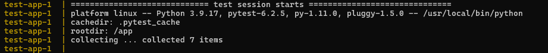
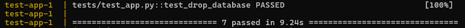
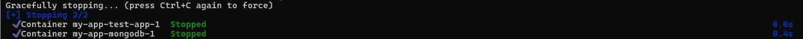
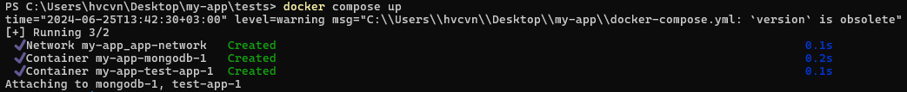

# Test Overview

The test suite is designed to ensure that the Flask application's task management functionalities, including creating, retrieving, updating, and deleting tasks, are functioning correctly. The tests interact with MongoDB, verifying both the application's response and the database's state to ensure consistency and correctness.

## Fixtures
- **app**: Configures the Flask application for testing, setting up a testing environment with a MongoDB URI and enabling the TESTING flag to isolate test effects from production.

- **client**: Provides a test client for the application configured by the app fixture, allowing simulation of requests to the application.

- **init_db**: Attempts to establish a connection with MongoDB, retrying up to five times with delays. It yields the database object for direct manipulation during tests.

## Individual Tests

### test_uncompleted_tasks

- **Purpose**: Verifies that the endpoint for retrieving uncompleted tasks is functioning as expected.
- **Process**: Makes a GET request to the 'tasks' endpoint and checks that the response status is 200 (OK) and that the response data contains a specific string, indicating that tasks are being retrieved correctly.

### test_add_task

- **Purpose**: Ensures that tasks can be added through the application.
- **Process**: Submits a POST request with task details to the 'action' endpoint and checks that the response redirects correctly (status 302). It then verifies that the new task is present in the MongoDB database, confirming the operation's success.

### test_complete_task

- **Purpose**: Tests the completion functionality of a task.
- **Process**: Adds a task and then sends a GET request to the 'done' endpoint with the task's ID. The test checks for a successful redirect and verifies that the task's status is updated in the database.

### test_remove_task

- **Purpose**: Tests the deletion functionality of a task.
- **Process**: First, a task is added to the database, then a GET request is sent to the 'remove' endpoint with the task's ID. The test checks for a successful redirect and verifies that the task is no longer present in the database.

### test_update_task

- **Purpose**: Checks the task update functionality.
- **Process**: Adds a task and then sends a POST request with updated task details to the 'action3' endpoint. The response is checked for a redirect, and the task in the database is verified to ensure it reflects the updated details.

### test_search_task

- **Purpose**: Confirms that tasks can be searched correctly.
- **Process**: Adds a task and makes a GET request to the 'search' endpoint with appropriate query parameters. It verifies that the response is correct and contains the details of the searched task, confirming the search functionality.

### test_drop_database
- **Purpose**: Ensures that the database can be cleaned up after tests.
- **Process**: Drops the `mymongodb` database to ensure data from test runs does not persist beyond the scope of the tests. This test verifies that the database is no longer listed after the drop operation.

## Debugging Information

Each test includes debug prints that show the state of the database before and after tests, which can be very helpful during development and debugging phases to understand the internal state and identify issues.

# Docker Compose Configuration

Docker Compose is used to define and run multi-container Docker applications. Here is an overview of the `docker-compose.yml` setup for running tests:

## Services

- **mongodb**:

  - **Image**: Uses the official MongoDB image tagged as latest.
  - **Environment**: Sets environment variables for MongoDB initialization (`root` username and `mongoDB` password).
  - **Ports**: Maps port 27017 on the host to the same port on the container.
  - **Networks**: Attaches to `app-network` for internal connectivity.

- **test-app**:
- **Build**:

    - **Context**: Specifies the directory containing the Dockerfile.
    - **Dockerfile**: Points to `Dockerfile.test`.
  - **Environment**: Defines `MONGO_URL` for the MongoDB connection string.
  - **Depends on**: Ensures MongoDB service starts before this service.
  - **Command**: Overrides the default command to run `pytest` with additional options.
  - **Networks**: Connects to `app-network`.

  

## Networks

- **app-network**:

  **Driver**: Uses the bridge driver, which creates a network bridge in Docker to enable the communication between the containers on the same Docker host. This isolated network helps prevent interference with other networks or services on the host machine.

## Usage in CI/CD

In the Jenkins pipeline, there's a stage named "Unit Test" where Docker Compose is used to set up the environment and execute the tests on the CI server. The setup involves running the services defined in `docker-compose.yml`, executing the tests, and then performing cleanup by shutting down the services. This process ensures that the application behaves as expected in a controlled environment, and if the tests pass, the pipeline proceeds to the next stages.

